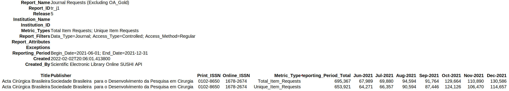

# SciELO SUSHI API

## Sumário

1. [Introdução](#1introdução)
2. [Usos mais comuns](#2usosmaiscomuns)
    1. [Tabela de parâmetros](#21tabeladeparâmetros)
3. [Exemplos reais](#3exemplosreais)
4. [Conceitos](#4conceitos)
    1. [Métricas COUNTER](#41métricascounterrelease5)
    2. [Relatórios disponíveis](#42relatóriosdisponíveis)

---

## 1. Introdução
SciELO SUSHI API, disponível em [usage.apis.scielo.org](http://usage.apis.scielo.org/), é uma ferramenta web para a obtenção de dados de acesso, no padrão [Project COUNTER Release 5](https://www.projectcounter.org/counter-release-5/), de documentos e periódicos da Rede SciELO. Essa API é capaz de informar valores de medidas de acesso relacionadas aos artigos publicados nos sites da rede SciELO agregados ou não em conjuntos de periódicos. Estão disponíveis na SciELO SUSHI API seis relatórios que apresentam métricas até quatro métricas de acesso. Para mais detalhes de cada relatório e métrica, acesse a seção Conceitos básicos. As listagens a seguir apresentam os relatórios e métricas disponíveis na SciELO SUSHI API.

**Relatórios**
- [Item Master Report A1](#item-master-report-a1-ir_a1): acessos por documento
- [Title Master Report J1](#title-master-report-j1-tr_j1): acessos por periódico
- [Title Master Report J4](#title-master-report-j4-tr_j4): acessos por periódico considerando ano de publicação dos documentos
- [Collection Report J1](#collection-report-j1-cr_j1): acessos por coleção SciELO
- [Geolocation Report J1](#geolocation-report-j1-gr_j1): acessos por periódico considerando o país origiário do acesso
- [Language Report J1](#language-report-j1-lr_j1): acessos por periódico considerando o idioma dos documentos

**Métricas**
- [Total Item Investigations](#total-item-investigations)
- [Unique Item Investigations](#unique-item-investigations)
- [Total Item Requests](#total-item-requests)
- [Unique Item Requests](#unique-item-requests)

---

## 2. Usos mais comuns
De forma resumida, os usos mais comuns que os diferentes interessados possam ter em relação ao uso da SciELO SUSHI API são descritos a seguir. Um **gestor de coleção** pode estar interessado em visualizar os resultados de acesso de todos os periódicos que compõem sua coleção. Para isso pode-se consultar pelo relatório **CR_J1**. É preciso informar o parâmetro "api=v2" e o acrônimo da coleção (parâmetro "collection", que para a coleção Brasil pode ser "scl" ou "nbr"). Segue o formato final da consulta:

- `http://usage.apis.scielo.org/reports/cr_j1?begin_date=2018-01&end_date=2021-12&api=v2&collection=<ACRÔNIMO>&fmt=tsv`

Um **editor de periódico** pode estar interessado em visualizar os resultados de acesso ao seu periódico. É possível consultar informações gerais, bem como agregadas por ano de publicação e idioma dos documentos. Também é possível obter os resultados de acesso considerando os países de origem de onde partiram os acessos. Há quatro relatórios de interesse: **TR_J1**, **TR_J4**, **LR_J1** e **GR_J1**. É preciso informar o parâmetro "api=v2", o acrônimo da coleção (parâmetro "collection") e o valor do ISSN, tal como em:

- `http://usage.apis.scielo.org/reports/tr_j1?begin_date=2021-06&end_date=2021-12&api=v2&collection=<ACRÔNIMO>&issn=<ISSN>&fmt=tsv`

- `http://usage.apis.scielo.org/reports/tr_j4?begin_date=2021-06&end_date=2021-12&api=v2&collection=<ACRÔNIMO>&issn=<ISSN>&fmt=tsv`

- `http://usage.apis.scielo.org/reports/lr_j1?begin_date=2021-06&end_date=2021-12&api=v2&collection=<ACRÔNIMO>&issn=<ISSN>&fmt=tsv`

- `http://usage.apis.scielo.org/reports/gr_j1?begin_date=2021-06&end_date=2021-12&api=v2&collection=<ACRÔNIMO>&issn=<ISSN>&fmt=tsv`

### 2.1. Tabela de parâmetros

| Parâmetro | Descrição | Formato | Valor padrão | Obrigatório | Observações |
| --------- | --------- | ------- | ------------ | ----------- | ----------- |
| `begin_date` | Data de início | `AAAA-MM-DD` ou `AAAA-MM` | N/A | Sim | O formato `AAAA-MM` é obrigatório para relatórios `CR_J1`, `GR_J1` e `LR_J1` |
| `end_date` | Data de fim | `AAAA-MM-DD` ou `AAAA-MM` | N/A | Sim | O formato `AAAA-MM` é obrigatório para relatórios `CR_J1`, `GR_J1` e `LR_J1` |
| `granularity` | Exibir valores por mês/ano ou apenas totais | `monthly` ou `totals` | `monthly` | Não | N/A |
| `issn` | Código ISSN de periódico | `0000-0000` | N/A | Não | N/A |
| `pid` | Código PID v2 ou v3 de documento SciELO | `S0000-00000000000000000` ou 23 letras ou dígitos | N/A | Não | Este parâmetro é aplicável apenas em relatórios `IR_A1` |
| `collection` | Acrônimo de coleção da Rede SciELO | 3 letras minúsculas | `scl` | Não | N/A |
| `fmt` | Formato de saída dos resultados | `json` ou `tsv` | `json` | Não | N/A |
| `api` | Versão da API utilizada | `v1` ou `v2` | `v1` | O parâmetro valorado com a versão 2 da api (`api=v2`) é obrigatório para os relatórios `CR_J1`, `GR_J1` e `LR_J1`  | N/A |


---

## 3. Exemplos reais
A SciELO SUSHI API pode ser acessada por meio do link [usage.apis.scielo.org](http://usage.apis.scielo.org), que exibe a mensagens de aviso da aplicação como a apresenta a seguir:

```json
[
    {
        "Description": "COUNTER Usage Reports for SciELO platform.",
        "Service_Active": true,
        "Registry_URL": "",
        "Note": "Registration is disabled",
        "Alerts": [
            {
                "Date_Time": "2021-02-01 23:42:52",
                "Alert": "Reports DR, DR_D1, DR_D2, PR, PR_1, TR_J2 and TR_J3 are currently unavailable."
            },
            {
                "Date_Time": "2022-02-02 10:02:00",
                "Alert": "Reports TR_J1, TR_J4, IR_A1, GR_J1, LR_J1 are available."
            }
        ]
    }
]
```

O endereço [usage.apis.scielo.org/reports](http://usage.apis.scielo.org/reports) exibe a lista de relatórios COUNTER disponíveis ou não na SciELO SUSHI API, tal como a seguinte mensagem:

```
[
    {
        "Report_Name": "Collection Usage",
        "Report_ID": "cr_j1",
        "Release": 5,
        "Report_Description": "Collection-level usage summarized by Metric_Type.",
        "Path": "http://usage.apis.scielo.org/reports/cr_j1"
    },
    ...,
    {
        "Report_Name": "Journal Requests by YOP (Excluding OA_Gold)",
        "Report_ID": "tr_j4",
        "Release": 5,
        "Report_Description": "Breaks down the usage of journal content, excluding Gold Open Access content, by year of publication (YOP), providing counts for the Metric_Types Total_Item_Requests and Unique_Item_Requests. Provides the details necessary to analyze usage of content in backfiles or covered by perpetual access agreement. Note that COUNTER reports do not provide access model or perpetual access rights details.",
        "Path": "http://usage.apis.scielo.org/reports/tr_j4"
    }
]
```

Para visualizar dados de acesso de uma coleção inteira para o período de 2021-06 a 2021-12 (em formato `json`), acesse [http://usage.apis.scielo.org/reports/cr_j1?begin_date=2021-06&end_date=2021-12&api=v2&collection=nbr](http://usage.apis.scielo.org/reports/cr_j1?begin_date=2021-06&end_date=2021-12&api=v2&collection=nbr). Será retornado um conteúdo em formato `json`, dado que o parâmetro `fmt` não foi informado. A aplicação atribui, por padrão, esse formato. Observe que foi utilizado o parâmetro `api=v2`, requerido para relatórios **CR_J1**. Também é possível obter esse relatório em formato `tsv`. Basta acrescentar na `url` anterior o seguinte conteúdo: `&fmt=tsv`. O resultado final será [`http://usage.apis.scielo.org/reports/cr_j1?begin_date=2021-06&end_date=2021-12&api=v2&collection=nbr&fmt=tsv`](`http://usage.apis.scielo.org/reports/cr_j1?begin_date=2021-06&end_date=2021-12&api=v2&collection=nbr&fmt=tsv`).

```json
{
    "Report_Header": {
        "Created": "2022-02-02T20:01:10.436855",
        "Created_By": "Scientific Electronic Library Online SUSHI API",
        "Customer_ID": "",
        "Report_ID": "cr_j1",
        "Release": 5,
        "Report_Name": "Collection Usage",
        "Institution_Name": "",
        "Institution_ID": [
            {
                "Type": "ISNI",
                "Value": ""
            }
        ]
    },
    "Report_Filters": [
        {
            "Name": "Begin_Date",
            "Value": "2021-06-01"
        },
        {
            "Name": "End_Date",
            "Value": "2021-12-31"
        }
    ],
    "Report_Attributes": [
        {
            "Name": "Attributes_To_Show",
            "Value": "Data_Type|Access_Method"
        }
    ],
    "Exceptions": [],
    "Report_Items": [
        {
            "Title": "nbr",
            "Item_ID": [],
            "Platform": "Scientific Electronic Library Online - SciELO Brasil",
            "Data_Type": "Collection",
            "Section_Type": "Journal",
            "Access_Type": "Open Access",
            "Access_Method": "Regular",
            "Performance": [
                {
                    "Period": {
                        "Begin_Date": "2021-06-01",
                        "End_Date": "2021-06-30"
                    },
                    "Instance": {
                        "Metric_Type": "Total_Item_Requests",
                        "Count": "28926002"
                    }
                },
                {
                    "Period": {
                        "Begin_Date": "2021-06-01",
                        "End_Date": "2021-06-30"
                    },
                    "Instance": {
                        "Metric_Type": "Unique_Item_Requests",
                        "Count": "26879500"
                    }
                },
                {
                    "Period": {
                        "Begin_Date": "2021-07-01",
                        "End_Date": "2021-07-31"
                    },
                    "Instance": {
                        "Metric_Type": "Total_Item_Requests",
                        "Count": "24516666"
                    }
                },
                {
                    "Period": {
                        "Begin_Date": "2021-07-01",
                        "End_Date": "2021-07-31"
                    },
                    "Instance": {
                        "Metric_Type": "Unique_Item_Requests",
                        "Count": "22844421"
                    }
                },
                {
                    "Period": {
                        "Begin_Date": "2021-08-01",
                        "End_Date": "2021-08-31"
                    },
                    "Instance": {
                        "Metric_Type": "Total_Item_Requests",
                        "Count": "30271245"
                    }
                },
                {
                    "Period": {
                        "Begin_Date": "2021-08-01",
                        "End_Date": "2021-08-31"
                    },
                    "Instance": {
                        "Metric_Type": "Unique_Item_Requests",
                        "Count": "28260171"
                    }
                },
                {
                    "Period": {
                        "Begin_Date": "2021-09-01",
                        "End_Date": "2021-09-30"
                    },
                    "Instance": {
                        "Metric_Type": "Total_Item_Requests",
                        "Count": "33613732"
                    }
                },
                {
                    "Period": {
                        "Begin_Date": "2021-09-01",
                        "End_Date": "2021-09-30"
                    },
                    "Instance": {
                        "Metric_Type": "Unique_Item_Requests",
                        "Count": "31215140"
                    }
                },
                {
                    "Period": {
                        "Begin_Date": "2021-10-01",
                        "End_Date": "2021-10-31"
                    },
                    "Instance": {
                        "Metric_Type": "Total_Item_Requests",
                        "Count": "39221708"
                    }
                },
                {
                    "Period": {
                        "Begin_Date": "2021-10-01",
                        "End_Date": "2021-10-31"
                    },
                    "Instance": {
                        "Metric_Type": "Unique_Item_Requests",
                        "Count": "36706954"
                    }
                },
                {
                    "Period": {
                        "Begin_Date": "2021-11-01",
                        "End_Date": "2021-11-30"
                    },
                    "Instance": {
                        "Metric_Type": "Total_Item_Requests",
                        "Count": "33265311"
                    }
                },
                {
                    "Period": {
                        "Begin_Date": "2021-11-01",
                        "End_Date": "2021-11-30"
                    },
                    "Instance": {
                        "Metric_Type": "Unique_Item_Requests",
                        "Count": "31174799"
                    }
                },
                {
                    "Period": {
                        "Begin_Date": "2021-12-01",
                        "End_Date": "2021-12-31"
                    },
                    "Instance": {
                        "Metric_Type": "Total_Item_Requests",
                        "Count": "20956150"
                    }
                },
                {
                    "Period": {
                        "Begin_Date": "2021-12-01",
                        "End_Date": "2021-12-31"
                    },
                    "Instance": {
                        "Metric_Type": "Unique_Item_Requests",
                        "Count": "19684062"
                    }
                }
            ]
        }
    ]
}
```

**Figura 1**. Imagem ilustrativa de um exemplo de relatório **CR_J1** em formato TSV. 


Para visualizar dados de acesso de apenas um periódico para o período de 2021-06 a 2021-12 (em formato `tsv`), acesse [http://usage.apis.scielo.org/reports/tr_j1?begin_date=2021-06&end_date=2021-12&api=v2&collection=nbr&issn=0102-8650&fmt=tsv](http://usage.apis.scielo.org/reports/tr_j1?begin_date=2021-06&end_date=2021-12&api=v2&collection=nbr&issn=0102-8650&fmt=tsv). Observe que também foi utilizado o parâmetro `api=v2`. Isso faz com que coleções como a SciELO Brasil, que possui dois sites (old.scielo.br e scielo.br) some os resultados de acesso para as diferentes representações existents.

**Figura 2**. Imagem ilustrativa de um exemplo de relatório **TR_J1** em formato TSV. 



Para visualizar dados de acesso de apenas um periódico, agregado pelo idioma dos documentos, para o período de 2021-06 a 2021-12 (em formato `tsv`), acesse [http://usage.apis.scielo.org/reports/lr_j1?begin_date=2021-06&end_date=2021-12&api=v2&collection=nbr&issn=0102-8650&fmt=tsv](http://usage.apis.scielo.org/reports/lr_j1?begin_date=2021-06&end_date=2021-12&api=v2&collection=nbr&issn=0102-8650&fmt=tsv). Observe que também foi utilizado o parâmetro `api=v2`, que possui o mesmo efeito indicado no exemplo anterior.

**Figura 3**. Imagem ilustrativa de um exemplo de relatório **LR_J1** em formato TSV. 


Para visualizar dados de acesso de apenas um periódico, agregado pelo país de origem dos acessos, para o período de 2018-01 a 2018-03 (em formato `tsv`), acesse [http://usage.apis.scielo.org/reports/gr_j1?begin_date=2018-01&end_date=2018-03&api=v2&collection=nbr&issn=0102-8650&fmt=tsv](http://usage.apis.scielo.org/reports/gr_j1?begin_date=2018-01&end_date=2018-03&api=v2&collection=nbr&issn=0102-8650&fmt=tsv). Observe que também foi utilizado o parâmetro `api=v2`, que possui o mesmo efeito indicado no exemplo anterior.

**Figura 4**. Imagem ilustrativa de um exemplo de relatório **GR_J1** em formato TSV. 


---

## 4. Conceitos

### 4.1. Métricas COUNTER Release 5
As métricas apresentadas pelos relatórios Project COUNTER R5 consideram os conceitos de sessão de usuário e de cliques-duplos. Uma sessão de usuário, no contexto SciELO, é formada pelos seguintes componentes: endereço IP do usuário, nome e versão do navegador de acesso, data do acesso e hora do acesso.

O campo “hora” é fatiado em 24 unidades, de modo que é possível haver 24 sessões em um dia considerando os mesmos valores para IP e navegador. Um registro no formato “2017-06-15 13:35, IP Address: 192.1.1.168, User Agent: Mozilla/5.0”, por exemplo, gera um código de sessão nos seguintes moldes: 192.1.1.168|Mozilla/5.0|2017-06-15|13.

Os cliques-duplos, isto é, acessos a um mesmo conteúdo, quando realizados num intervalo de tempo curto e numa mesma sessão, são tratados. No contexto SciELO, considera-se um clique duplo quando um usuário acessa uma mesma informação mais de uma vez num intervalo de 30 segundos ou menos, considerando a sessão corrente. Nesses casos, mantém-se nas contagens o acesso mais recente realizado.

Nos sites da Rede SciELO, em que não há conceito de usuário e senha para acessar o conteúdo dos documentos, o endereço IP e o agente de usuário são usados para formar sessão e rastrear cliques-duplos. Na situação em que muitos usuários estão sob um mesmo endereço IP com um mesmo agente de usuário, pode ocorrer de cliques executados por usuários diferentes serem tratados como cliques-duplos. Mas isso só ocorrerá se múltiplos usuários estiverem acessando o mesmo conteúdo no mesmo momento. E esse é um comportamento improvável e que representa pouco percentual na totalidade dos acessos. Ainda, dados de IPs locais da rede SciELO são ignorados, como orientado pelo Project COUNTER R5.

As métricas COUNTER estão organizadas conforme o tipo de conteúdos acessados e como foram acessados. O termo “Unique” é utilizado nas métricas que usam o conceito de sessão para contar os acessos. Por um lado, quando um endereço (ou documento) é acessado por um usuário numa mesma sessão, mais de uma vez (não sendo um duplo-clique), é contabilizado apenas uma vez nas métricas “Unique”. Por outro lado, nas métricas que adotam o termo “Total”, esses acessos são contabilizados quantas vezes ocorrerem.

Outros dois termos são “Requests” e “Invetigations”. O primeiro remete ao acesso a documentos completos de artigos, independentemente de seu formato - e apenas conteúdos completos são contabilizados, neste caso. O segundo remete ao acesso a informações extras dos documentos, tais como as páginas de “Como citar”, “Informações adicionais de autores”, “Resumo”, entre outras - além dos acessos ao conteúdo completo dos documentos. As subseções seguintes descrevem cada uma das quatro métricas consideradas nos relatórios produzidos pela SciELO SUSHI API.

#### Unique Item Requests
O termo _Unique Item_ remete a unidade de conteúdo acessada pelos usuários. Pode ser uma seção de livro, um capítulo de livro, um livro (se disponibilizado como um arquivo único), um artigo ou um conteúdo multimídia. No caso da Rede SciELO, um _Unique Item_ é um artigo, cujo identificador é um PID (e isso independe do formato do texto completo disponibilizado, tais como PDF, HTML ou EPUB). Caso o usuário clique para visualizar o artigo e então para baixá-lo, no caso da métrica _Unique Item Requests_, apenas um acesso é contabilizado (se for realizado durante uma mesma sessão). Essa contagem difere da métrica _Total Item Requests_ por não contabilizar mais de um acesso durante uma mesma sessão para um mesmo conteúdo. Quando se trata do termo _Requests_, apenas o conteúdo completo do documento é contabilizado.

#### Total Item Requests
_Total Item Requests_ é uma métrica que contabiliza o número de vezes que um usuário clica para baixar um artigo completo, seja em PDF, HTML ou outro formato - cliques para visualizar resumo ou outras informações não são contabilizados. Caso o usuário clique para visualizar o artigo e então para baixá-lo, são contados dois acessos.

#### Unique Item Investigations
_Unique Item Investigations_ é uma métrica que contabiliza cliques para obtenção de informação extra e para download ou acesso à versão completa de artigos. Cliques repetidos para obtenção da mesma informação são contados apenas uma vez.

#### Total Item Investigations
_Total Item Investigations_ é uma métrica que contabiliza cada clique que apresenta informação extra ao usuário sobre um documento e cada clique que coleta seu conteúdo completo em qualquer formato. A informação extra pode ser, por exemplo, o resumo do documento, detalhamentos sobre os autores, dados de como citar o documento, entre outros. Já a coleta do conteúdo completo é o evento de se obter o documento de forma integral, independentemente de seu formato. Cliques repetidos para obtenção da mesma informação são contados todas as vezes que ocorrerem numa sessão, desde que não sejam cliques-duplos.

### 4.2. Relatórios disponíveis
Nas estruturas da Rede SciELO foram implantados três relatórios COUNTER Release 5 e três extensões. Os relatórios responsáveis por obter dados agregados por periódico são **TR_J1**, **LR_J1**, **GR_J1** e **TR_J4**, sendo este último considerando o ano de publicação dos documentos. Os dados agregados por artigo são representados pelo relatório **IR_A1**. Dados agregados para uma coleção inteira são representados por relatórios **CR_J1**. Observe que, originalmente, não existem relatórios **GR_J1**, **LR_J1** e **CR_J1** no Project COUNTER R5 - essas foram extensões implementadas e contextualizadas ao Programa SciELO.

#### Item Master Report A1 (IR_A1)
Relatórios **IR_A1** fornecem um resumo da atividade relacionada ao conteúdo no nível de artigo. É um meio de avaliar o impacto que um artigo possui, em termos de acesso. É preciso conhecer o identificador único de um artigo (os códigos PID, no âmbito SciELO).

#### Title Master Report J1 (TR_J1)
Relatórios **TR_J1** abordam o acesso a conteúdo no nível de periódico, excluindo documentos Gold Open Access. A métrica Unique Item Requests, no contexto desse relatório, fornece uso comparável em plataformas de periódicos, reduzindo o efeito inflacionário que ocorre quando um texto completo em HTML é exibido automaticamente e o usuário acessa a versão em PDF. A métrica Total Item Requests mostra a atividade geral relacionada ao periódico. É preciso informar o código ISSN de um periódico, caso deseja-se saber apenas os dados a ele referentes. Na situação em que essa informação é omitida, são retornados dados de todos os periódicos da coleção.

#### Title Master Report J4 (TR_J4)
Relatórios **TR_J4** descrevem o uso de conteúdo de periódico, excluindo documentos Gold Open Access. A informação, nesse relatório, é agregada por ano de publicação (YOP) dos documentos.

#### Collection Report J1 (CR_J1)
Relatórios **CR_J1** descrevem o uso de uma coleção inteira. Esse relatório é uma extensão do Project COUNTER R5 que foi contextualizada ao universo SciELO, que organiza os periódicos em coleções (temáticas ou associadas a países).  Em outras palavras, relatórios **CR_J1** são uma versão agregada de relatórios **TR_J1** considerando os acessos concedidos a todos os artigos de todos os periódicos associados a uma coleção. Na situação em que esse relatório é obtido com o parâmetro _api=v2_, agrega todos os acrônimos que representam uma mesma coleção (por exemplo, para coleção SciELO Brasil, os acrônimos _nbr_ e _scl_).

#### Language Report J1 (LR_J1)
Relatórios **LR_J1** descrevem o uso de periódicos considerando o idioma dos documentos acessados. Essa também é uma extensão do Project COUNTER R5 que foi contextualizada ao universo SciELO, que possui textos completos em Português, Inglês, Espanhol e outros idiomas (e isso, por vezes, para um mesmo artigo). Os resultados apresentados por esse relatório agregam as métricas por cada um dos idiomas. Assim, se um periódico possui 100 artigos em Português e 50 em Inglês, por exemplo, para cada um desses idiomas haverá um conjunto de métricas de acesso. Assim como o relatório **CR_J1**, relatórios **LR_J1** são acessados por meio do parâmetro _api=v2_.

#### Geolocation Report J1 (GR_J1)
Relatórios **GR_J1** descrevem o uso de periódicos considerando o país de origem do acesso realizado aos documentos. Essa também é uma extensão do Project COUNTER R5 que foi contextualizada ao universo SciELO. Os resultados apresentados por esse relatório agregam as métricas por cada um dos países de origem dos acessos (em termos de códigos ISO). Assim como os relatórios **CR_J1** e **LR_J1**, relatórios **GR_J1** são acessados por meio do parâmetro `api=v2`.
